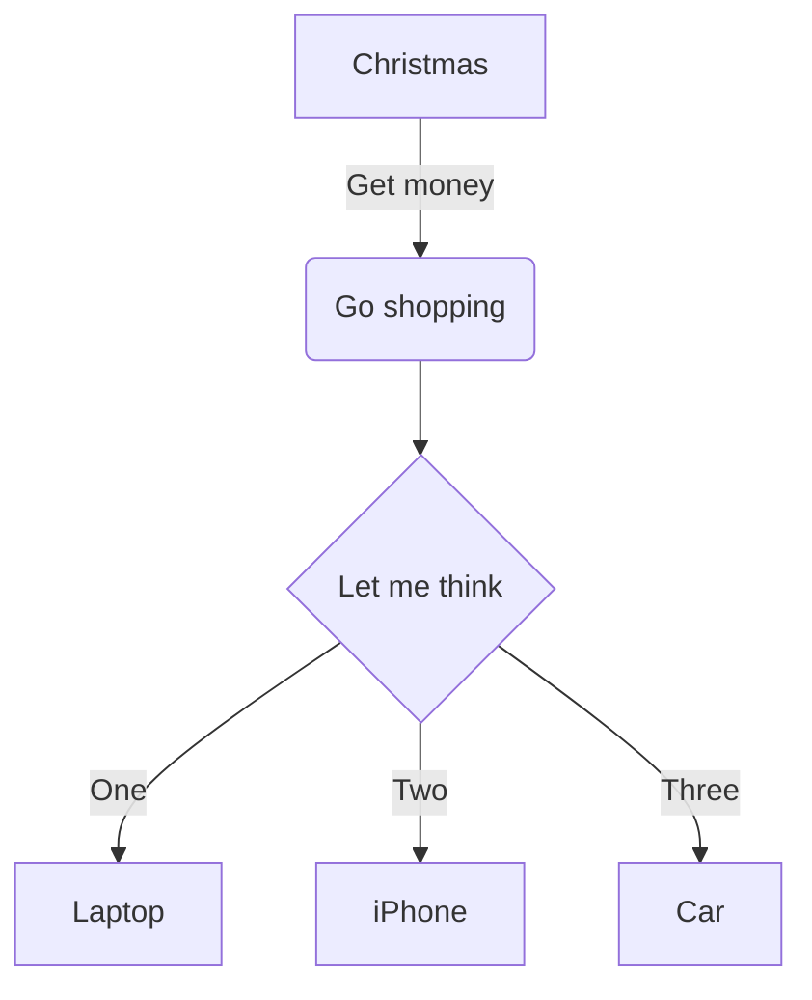

# Mermaid 图表转图片工具

这是一个基于React的应用程序，可以将Mermaid语法图表转换为PNG或SVG格式的图片。

## 功能特点

- 实时预览Mermaid图表
- 支持下载PNG和SVG格式
- 语法错误提示
- 响应式设计，适配不同设备

## 安装

1. 克隆仓库
```bash
git clone https://github.com/your-repo/mermaid-to-image.git
```

2. 安装依赖
```bash
cd mermaid-to-image
npm install
```

3. 启动应用
```bash
npm start
```

## 使用方法

1. 在文本框中输入Mermaid语法图表
2. 实时预览图表效果
3. 点击"下载PNG"或"下载SVG"按钮保存图片

## 示例代码



## 注意事项

- 确保使用正确的Mermaid语法
- 图表过大时可能需要调整浏览器缩放
- 下载功能在某些浏览器可能需要允许弹出窗口

## 开发

### 可用脚本

`npm start` - 启动开发服务器
`npm run build` - 构建生产版本
`npm test` - 运行测试

## 依赖

- React 19
- Mermaid 11
- html-to-image
