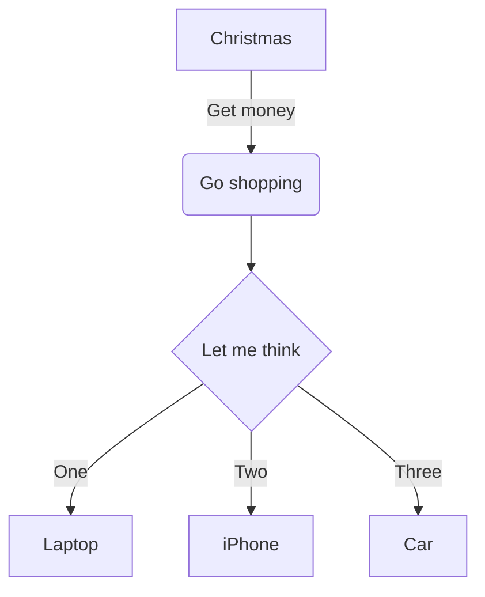

# Mermaid 图表转图片工具

这是一个基于React的应用程序，可以将Mermaid语法图表转换为PNG或SVG格式的图片。

## 功能特点

- 实时预览Mermaid图表
- 支持下载PNG和SVG格式
- 语法错误提示
- 响应式设计，适配不同设备
- Docker支持，便于部署

## 安装

### 方法一：本地开发

1. 克隆仓库
```bash
git clone https://github.com/your-repo/mermaid-to-image.git
```

2. 安装依赖
```bash
cd mermaid-to-image
npm install
```

3. 启动应用
```bash
npm start
```

### 方法二：使用Docker

1. 使用Docker镜像
```bash
docker pull yourusername/mermaid-to-image:latest
docker run -p 8080:80 yourusername/mermaid-to-image:latest
```

2. 或者使用Docker Compose
```bash
docker-compose up -d
```

访问 http://localhost:8080 即可使用应用。

## 使用方法

1. 在文本框中输入Mermaid语法图表
2. 实时预览图表效果
3. 点击"下载PNG"或"下载SVG"按钮保存图片

## 示例代码



## 注意事项

- 确保使用正确的Mermaid语法
- 图表过大时可能需要调整浏览器缩放
- 下载功能在某些浏览器可能需要允许弹出窗口

## 开发

### 可用脚本

`npm start` - 启动开发服务器
`npm run build` - 构建生产版本
`npm test` - 运行测试

## Docker部署

### 本地构建和运行

1. 构建Docker镜像
```bash
docker build -t mermaid-to-image .
```

2. 运行容器
```bash
docker run -p 8080:80 mermaid-to-image
```

### 推送到DockerHub

1. 登录到DockerHub
```bash
docker login
```

2. 为镜像添加标签
```bash
docker tag mermaid-to-image yourusername/mermaid-to-image:latest
```

3. 推送镜像
```bash
docker push yourusername/mermaid-to-image:latest
```

### 使用GitHub Actions自动构建和推送

本项目已配置GitHub Actions工作流，可以在代码推送到主分支或创建新标签时自动构建并推送Docker镜像到DockerHub。

要启用此功能，请在GitHub仓库设置中添加以下密钥：
- `DOCKERHUB_USERNAME`: 你的DockerHub用户名
- `DOCKERHUB_TOKEN`: 你的DockerHub访问令牌

## 依赖

- React 19
- Mermaid 11
- html-to-image
- Docker & Nginx (用于容器化部署)
